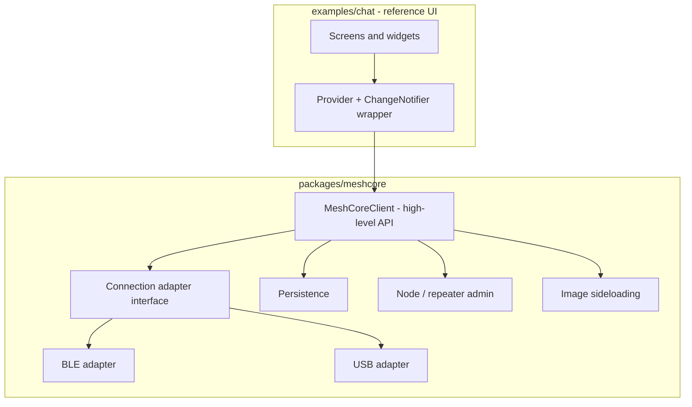

# Extract MeshCore Dart API library (full API + examples/chat)

## Goal

- **Library**: Expose **most app features at the API level** so others can build new UIs without reimplementing logic.
  - **High-level (chat-like)**: Channel management, contact lists, messages, node admin (local + repeater), image sideloading, persistence, retry, path history, optional notification hooks.
  - **Low-level (transport)**: A **connection adapter** abstraction — connect, disconnect, send/receive frames. **BLE** and **USB** (incoming) are providers for this adapter; the design allows adding **WiFi** or other transports later. The high-level API is transport-agnostic.
- **This repo**: The current Flutter app becomes **examples/chat** — a **reference implementation** that only builds UI and calls the library. No business logic in the example; it exists to show how to use the full API.

## Current state

- **lib/connector/meshcore_connector.dart** (~4,200 lines): BLE, protocol, contacts, channels, messages, channel messages, repeater CLI/acks, path selection, image upload, persistence (ContactStore, MessageStore, ChannelStore, ChannelMessageStore, UnreadStore, etc.), notifications, retry, path history. Extends `ChangeNotifier`.
- **lib/connector/meshcore_protocol.dart** (~850 lines): Pure Dart protocol (BufferReader/Writer, command/response/push codes, frame builders, parsing).
- **Models, services, storage**: Contact, Channel, Message, ChannelMessage; RepeaterCommandService, MessageRetryService, PathHistoryService, NotificationService, storage classes, etc. All of this should move into or behind the library API so the library offers the same capabilities.

## Layered API: high-level vs low-level

- **High-level (chat-like)**: Contacts, channels, messages, node admin (local + repeater), image sideloading, persistence, retry, path history. What most UIs need; the library exposes this as the main API (e.g. `MeshCoreClient`).
- **Low-level (transport)**: Raw frame I/O — connect, disconnect, send bytes, receive stream — and discovery (e.g. scan) where the transport supports it. The library defines a **connection adapter** interface for this; the high-level client uses whichever adapter is provided and does not care how bytes are carried.

**Connection adapter (pluggable transports)**  
BLE and USB (incoming) — and conceivably WiFi or other means later — are **providers** for a single **connection adapter** abstraction. The core client is constructed with an adapter (e.g. `MeshCoreClient(connectionAdapter)`). Adapter interface is minimal: e.g. connect (by some device identifier), disconnect, send `Uint8List`, stream of received `Uint8List`; for discovery, either the adapter exposes a scan/discover API or the app passes in an already-connected handle. That way:
- **BLE** and **USB** (when added) each implement the same adapter interface.
- A future **WiFi** or other transport can be added by implementing the same interface; no changes to the high-level API.

## Target architecture

- **packages/meshcore**: Full API in two layers.
  - **Connection adapter (low-level)**: Abstract interface — connect, disconnect, send frame, stream of received frames; optional discover/scan where applicable. **BLE** and **USB** (incoming) implement this; someone can add **WiFi** or another transport by implementing the same interface.
  - **MeshCoreClient (high-level)**: Takes a connection adapter in the constructor. Exposes: contacts, channels, messages, node admin (local + repeater), image sideloading, persistence, retry, path history. All chat-like features; transport-agnostic.
  - **Persistence**, **node admin**, **image sideloading**: As before; implemented inside the library, used via the high-level API. Optional notification callbacks for UIs.
- **examples/chat**: Current app moved under `examples/chat/`. Depends on meshcore, creates a client with a BLE (or USB, when available) adapter, wraps in Provider for UI, and only calls library APIs — reference for "how to call the library."

## What goes into the library (full API)

| Layer | Area | In library |
|-------|------|------------|
| **Low-level** | **Connection adapter** | Abstract interface (connect, disconnect, send frame, receive stream; optional discover/scan). **BLE** and **USB** (incoming) as providers; design allows future **WiFi** or other transports. |
| | **Protocol** | BufferReader/Writer, constants, frame builders, parsing (from meshcore_protocol.dart). |
| **High-level** | **Client** | MeshCoreClient(adapter): connection state, sendFrame, getContacts, getChannels, sendMessage, sendChannelMessage, sync messages, self info, radio params, battery, etc. |
| | **Contacts** | Full contact list API, path override, path selection for send, refresh, get by key; persistence (default or abstract store). |
| | **Channels** | Get/set channel, channel messages load/send, order and settings (Smaz); persistence. |
| | **Messages** | Contact and channel messages, retry logic, unread/mark read; persistence. |
| | **Node admin** | Local: set radio, TX power, time, reboot, advert, custom vars, etc. Repeater: send CLI command with path/ack, get/set repeater settings (name, password, radio, lat/lon, repeat, allow.read.only, privacy, advert intervals). |
| | **Image sideloading** | API to prepare and send image messages (encode/upload flow used by current app). |
| | **Helpers** | Smaz, ReactionHelper (parsing), path history, message retry — all behind the API. |
| | **Optional** | Notification/event callbacks (e.g. onNewMessage, onNewContact); default persistence so examples work out of the box. |

## What stays in examples/chat (reference UI only)

- Flutter screens and widgets (scanner, device hub, chat, contacts, channels, settings, repeater settings, repeater CLI, maps, etc.).
- Provider/ChangeNotifier wrapper around the library client for reactive UI.
- L10n, theme, app shell, navigation.
- No protocol code, no storage implementation (use library defaults or inject from library), no business logic — only calls to the library API to demonstrate usage.

## Repo layout

- **packages/meshcore/** (or split into meshcore_dart + meshcore_ble + meshcore_usb if you want transport-specific packages):
  - **Connection adapter**: Abstract interface in core; BLE adapter (and later USB adapter) implement it. Same interface allows future WiFi or other transports.
  - **Public API**: `MeshCoreClient(ConnectionAdapter adapter)` for high-level use. Optional factories like `MeshCoreClient.withBle()` / `MeshCoreClient.withUsb()` that build client + that adapter. All chat-like features are methods/streams on the client (e.g. `client.contacts`, `client.repeater.sendCommand(contact, command)`).
  - **Implementation**: protocol, adapter implementations (BLE, USB when ready), models, persistence, repeater command service, image sideloading, retry, path history, in `lib/src/`.
- **examples/chat/**:
  - Current app moved here; depends on `packages/meshcore`. Chooses an adapter (BLE today; USB when available) and passes it to the client. UI only calls library API.

## Incremental migration strategy

1. **Define connection adapter and protocol**  
   Add `packages/meshcore` with protocol (frame format, builders, parsing). Define the **connection adapter** interface: connect(identifier), disconnect, send(Uint8List), Stream&lt;Uint8List&gt; received; optional discover/scan. Implement **BLE adapter** (and Web BLE if needed) as first provider. Export a minimal client that takes an adapter and does connect + sendFrame + received stream. Design the interface so **USB** (incoming) and future **WiFi** can plug in the same way.

2. **Move models and client logic**  
   Move Contact, Channel, Message, ChannelMessage and full frame handling, contacts/channels/messages state, and high-level methods (getContacts, sendMessage, etc.) into the library. MeshCoreClient(adapter) exposes the same logical API the current connector exposes; it only talks to the adapter for I/O.

3. **Move persistence**  
   Move or abstract ContactStore, MessageStore, ChannelStore, ChannelMessageStore, UnreadStore, channel order/settings, contact settings into the library (default file-based or in-memory impl + optional interfaces so the example can use defaults).

4. **Move node admin and repeater**  
   Move RepeaterCommandService (CLI with path selection and ack tracking) and repeater settings fetch/set logic into the library; expose as e.g. `client.repeater.sendCommand(contact, command)` and `client.repeater.getSettings` / `setSettings`. Move local device admin (radio, TX power, time, reboot, etc.) into the client API.

5. **Move image sideloading**  
   Move current image upload/encode flow into the library and expose as a clear API (e.g. prepare image for send, then send message with attachment).

6. **Move retry, path history, notifications**  
   Message retry and path history live in the library; optional notification callbacks (onNewMessage, etc.) so the example can show notifications by implementing the callback.

7. **Relocate app to examples/chat**  
   Move current app into `examples/chat/`, point its dependency to the new package, and replace direct use of connector internals with library API calls. Remove duplicated protocol/storage/retry/repeater logic from the example so it is UI-only plus minimal glue (e.g. Provider wrapper).

8. **Document and trim**  
   Ensure every feature in the reference app is clearly traceable to a library call. Add minimal README or comments in examples/chat that point to the library API for each screen/flow.

## Dependency summary

- **meshcore**: `sdk`, `crypto`, `pointycastle`, `uuid`; BLE impl adds `flutter_blue_plus` (and Flutter SDK if in same package). Optional: `path_provider` (or similar) for default persistence.
- **examples/chat**: `meshcore` (path), `provider`, `flutter`, and UI-related deps (l10n, maps, etc.). No protocol or storage implementation in the example.

## Open decisions

- **Single package vs separate transport packages**: One package keeps the full API in one place; splitting (e.g. meshcore_dart + meshcore_ble + meshcore_usb) lets consumers depend only on the transports they need. Either way, the **connection adapter** is the single abstraction; BLE and USB (and later WiFi, etc.) are just providers.
- **USB**: Incoming. Implement a second adapter (e.g. `UsbConnectionAdapter`) that satisfies the same interface; no change to MeshCoreClient or high-level API. Platform-specific USB APIs (e.g. dart usb, or platform channels) live behind the adapter.
- **ReactionHelper**: Move into library so Message/ChannelMessage can carry reaction data for any frontend; or keep parsing in library and leave display to UIs.
- **Publish**: If publishing to pub.dev, name the package and decide whether BLE/USB are bundled or optional/separate packages.

This plan puts the full app feature set in the library API (high-level chat + low-level connection adapter), makes BLE and USB pluggable providers for that adapter, allows future transports (e.g. WiFi), and makes this repo's UI the reference example (examples/chat).
